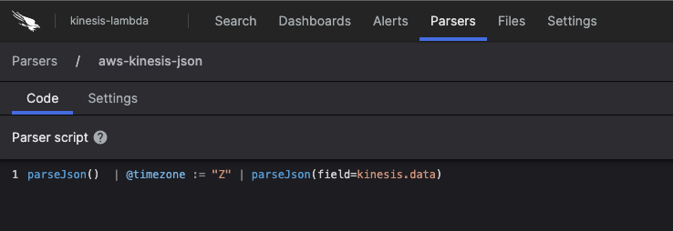

[](https://twitter.com/CrowdStrike)<br/>

# AWS Lambda Function: Kinesis to Falcon LogScale Shipper

A Python AWS Lambda function to send AWS Kinesis stream events to Falcon LogScale.

## Installation and Setup

### Prepare AWS Kinesis

- create a Kinesis data source, or identify an existing source


### Prepare AWS Lambda 

- create a new Python (`python3.9`) AWS Lambda function to host the code
  - copy/paste the `lambda_function.py` code to the new Lambda function `lambda_function.py`
- create new file named `logscale.py`, in the Lambda function
  - copy/paste the `logscale.py` code
<p align="left"></p>

- configure required Lambda environmental variables
  - HOST - target LogScale server
  - REPOSITORY - target LogScale repository
  - TOKEN - LogScale ingest token
<p align="left"></p>

- configure the lambda run timeout setting
  - increase the function timeout value above the default (3 secs)
    - recommend at least thirty (30) seconds.  monitor logs for timeouts.

#### Attach Requests Lambda Layer

- Attach a Lambda layer that contains the python requests library
    - create a new layer; upload zipfile that contains requests library
    - or, attach and existing requests layer to the Lambda

#### Enable a Kinesis Trigger

- Enable a lambda trigger from the kinesis source
<p align="left"></p>

#### Create Lambda Test Events

- create test events; test the function

#### Edit `lambda_function.py`


##### set the HecEvent source and sourcetype

- source - set to a unique name for the kinesis stream
- sourcetype - set to the destination LogScale ingest parser name
```python
    # suggestion: set the source field to uniquely identify the CloudTrail stream
    source = "my-kinesis-stream"
    # requirment: set the sourcetype to the target ingest parser name
    sourcetype = "aws-kinesis"
    hec_event = HecEvent(host=LOGSCALEHOST, index=REPOSITORY, source=source, sourcetype=sourcetype)
```
##### create additional HEC event fields (optional)
```python
    # optional: additional hec fields
    # example
    #   hev['fields'].update({"trigger": "kinesis"})
    #   field name: "trigger"; field value: "kinesis"
    hev['fields'].update({"trigger": "kinesis"})
```


### Prepare LogScale

#### Setup the Ingest Repository

- create a new target ingest repository, or select an existing repository

<p align="left"></p>

- create an ingest token, or use the default token
- configure ingest parsing
    - kinesis outer event format is JSON
        - `parseJson()  | @timezone := "Z"`
    - kinesis event payload (`kinesis.data`) format varies according to stream format - `[JSON|CSV|TSV|SYSLOG]`
        - e.g. JSON `parseJson(field=kinesis.data)`
    - example JSON parser (see `aws-kinesis-json.yaml`):
        - `parseJson()  | @timezone := "Z" | parseJson(field=kinesis.data)`
<p align="left"></p>

- Note: event timestamp is set to lambda ingest time; timezone is GMT

---

<p align="center"><BR/></p>
<h3><p align="center">WE STOP BREACHES</p></h3>
